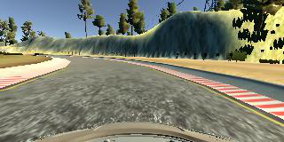
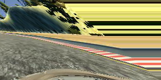
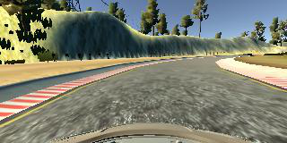
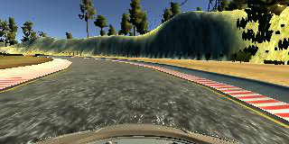

# Self-Driving Car Engineer Nanodegree Program
# *CarND-Behavioral-Cloning*

## Introduction

In this project, a CNN model had to be implemented and trained to manoever autonomously a car around a racing course by visual guidance and determining the according steering by a trained CNN.

**Result**:
* Driving the racing course [YouTube video] (https://www.youtube.com/watch?v=MyJA2STkLto)

## Implementation 
This project includes the following files:

*	**model.py**: 		Containing the script to create and train the model
*	**drive.py**: 		For driving the car in autonomous mode
*	**model.h5**: 		Containing a trained convolution neural network 

Using the Udacity provided simulator and drive.py file, the car can be driven autonomously around the track by executing:

`python drive.py model.h5`

The **model.py** file contains the code for loading the input images for training and saving the convolution neural network. The architecture of the CNN is similar to the NVidia CNN. It decides on the steering to be taken for safe driving around the racing course based upon pictures of the course.

## Model Architecture
The architecture used is similar to the one from NVidia. Just layer 6, flat had to be reduced from 1164 to 512 in dimension to consider the cropping of the input data:
1. Cropping Layer: (160,320,3) -> (80,320,3)
2. Normalization Layer
3. Layer 1
   1. Conv2D: 80x320x3 -5x5-> 80x320x24, relu, padding=same
   2. Pool: 80x320x24 -2x2-> 40x160x24
4. Layer 2
   1. Conv2D: 40x160x24 -5x5-> 40x160x36, relu, padding=same
   2. Pool: 40x160x36 -2x2-> 20x80x36
5. Layer 3
   1. Conv2D: 20x80x36 -5x5-> 20x80x48, relu, padding=same
   2. Pool: 20x80x48 -2x2-> 10x40x48
6. Layer 4
   1. Conv2D: 10x40x48 -3x3-> 8x38x64, relu, padding=valid
   2. Pool: 8x38x64 -2x2-> 4x19x64
7. Layer 5
   1. Conv2D: 4x19x64 -3x3-> 2x17x64, relu, padding=valid
   2. Pool:  2x17x64 -3x3-> 1x8x64
8. Layer 6
   1. Flat: 1x8x64 -> 512
   2. Fully connected: 512 -> 512
9. Layer 7
   1. Fully connected: 512 -> 100
10. Layer 8
    1. Fully connected: 100 -> 50
11. Layer 9
    1. Fully connected: 50 -> 10
12. Layer 10
    1. Fully connected: 10 -> 1

The architecture starts with cropping the input by taking 60 lines from the top and 20 from the bottom. Afterwards, the images get normalized. Layer 1 to 3 use 5x5 filter with padding=same and relu as an activation function. Layer 4 and 5 use 3x3 filters with padding=valid and relu as an activation function. After flattening, Layer 6 to 10 form fully connected with 512, 100, 50, 10, 1 neurons respectively. Dropout functionality led to worse behavior of the model. Therefore, no dropout was considered in the final model.
For optimization, Adam with a learning rate of 0.0005 has been used. All the simulations were done with 8 epochs and the input data were shuffled.

## Training Data
The data for training the model consists of pictures taken from the following activities
1.	2 laps, counter-clockwise (forward), track 1
2.	2 laps, clockwise (rear direction), track 1
3.	Extra recordings of difficult curves, mainly of the S-curve after the bridge, forward, track 1
4.	Extra recordings of returning from the boundary to the center of the road, forward, track1
5.	1 lap, track 2

For each item, the pictures were collected in a separate folder. In the final model, all three camera pictures have been considered for all the items. For the first item, manually determined steering corrections for the left and right camera have been undertaken.
Additionally, for the first two items, random augmentation has been done by the following functions:

* Shearing, with a shearing probability of 0.9

|Original Picture	                   |Sheared Picture                           |
|:----------------------------------------:|:----------------------------------------:|
|
|
|

 
* Flipping, with a probability of 0.5

|Original Picture	|Flipped Picture|
|:----------------------------------------:|:----------------------------------------:|
|
|
|
	 

* Gamma operation between [0.4, 1.5]

|Original Picture	|Gamma operated Picture|
|:----------------------------------------:|:----------------------------------------:|
|
|
|
 

In total, the dataset contained 63.879 samples with a 80% split between test and validation data (test: 51103, validation: 12776).

 
## Training Strategy
The training of the model was started with the first training set (counter-clockwise, 2 laps). The steering values for the left and right camera were adjusted manually by just using the data of the left or right camera and fine tuning the steering correction until the car drove almost ahead. To add stability for right turns, the data of the second training set (clockwise, 2 laps) has been added afterwards extended by a set of flipped pictures of all the cameras for both training sets. All of the above was trained on the LeNet architecture.

For more smoothly driving, the flipped pictures were replaced by a set of augmentated ones (flipping, gamma, shearing) executed randomly on the two training sets. Under these conditions, the car failed either in the long lasting curve area before the bridge, sometimes on the bridge or directly after the bridge by driving onto the sandy road.

With the two training sets implemented and augmented, the LeNet architecture has been replaced by the NVidia architecture. A cropping layer was added which led to adoption of layer 6 to consider the reduction of the input data. Also, the padding of layer 1 to 3 had to be changed to “same”. The Adam optimizer was used and the learning rate was adjusted to 0.0005 as the data seemed to fit better with it. The data was split by 80% into test data and validation data and shuffled. After the change, the car “just” failed at the sandy road after the bridge.

To convince the car to solve the S-curve after the bridge, three additional training sets were generated:
1.	Driving solely the S-curve several times
2.	Recording back turns from the boundary of the street back to the center
3.	Driving 2nd track, normal direction, 1 lap

It turned out that the last training set (2nd track) was absolutely necessary to solve the track. Without it, the other two failed. But, models just using 2nd track data in addition failed, too. So, a combination of the 2nd track data with one of the other was successful but all together (in addition to the existing training sets) lead to a really smooth driving on the track.

